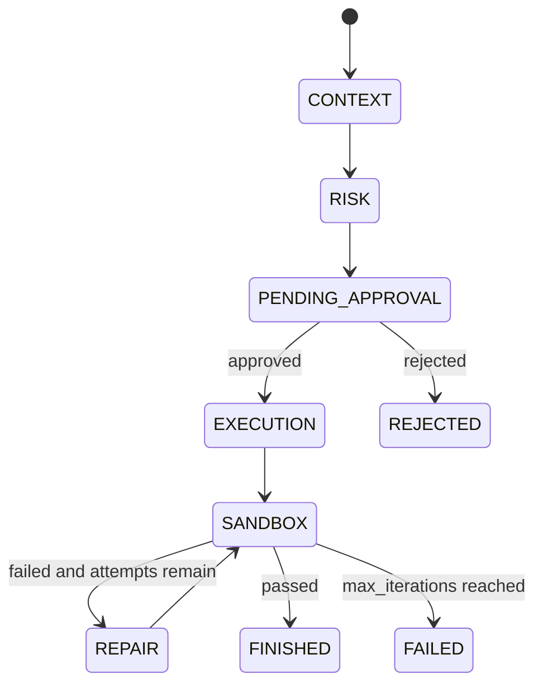

# AegisHarness Architecture

## Overview

AegisHarness is a five-phase event-driven state machine for safe agentic coding. The current implementation uses a React console and a conda-runnable Python backend. Live AI calls prefer Gemini when `GEMINI_API_KEY` exists, with Clod as fallback.

## Layers

- Frontend console: natural-language intake, HITL editing, phase status, event stream, route result, sandbox result, final code output
- Backend state machine: typed task states, approval gate, route decision, bounded greploop
- Prompt layer: Person C prompt rewrite template and negative-constraint assembly
- Integration layer: Gemini primary AI seam, Clod fallback AI seam, AI preflight seam, TREX sandbox seam

## State Flow



## Domain Rules

- `PENDING_APPROVAL` is mandatory before execution.
- The approved prompt must include retrieved context and negative constraints.
- Difficulty score must be persisted with the route decision.
- AI prompt rewriting and code generation should use Gemini first when `GEMINI_API_KEY` exists, then Clod fallback. Difficulty controls budget and runtime policy.
- `max_iterations = 3` is a hard greploop cap.
- `FINISHED` requires sandbox pass.
- The simplified MVP has no settlement/payment transition.

## Mock API Contract

```text
POST /tasks
GET  /tasks/:id
POST /tasks/:id/approve
POST /tasks/:id/reject
GET  /tasks/:id/events
```

Future FastAPI endpoints should emit the same event names used by the frontend and Python integration test.

## Conda Backend Test

The Python backend integration contract can be tested without external dependencies:

```bash
conda run -n aegis-harness python -m unittest discover -s backend/tests
```
